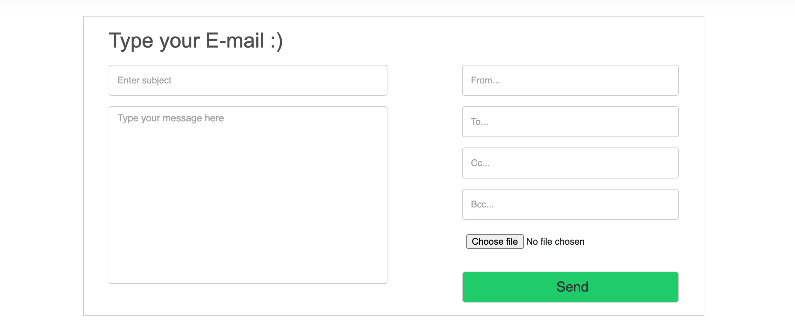

## Supported Flows

Currently the service support 3 flows. 

1. Sending the email through UI.
    
    
    
    The user can specify
    * Sender: Email id of the sender
    * Receiver: Emails id/ids of the recipients (comma separated)
    * Cc: cc email ids (comma separated)
    * Bcc: bcc email ids (comma separated)
    * Subject: Subject of the email
    * Body: In the large textarea the user and write
    the body of the email
    * Attach File: User can also attach any file to the
    mail 

2. Sending emails via csv file through API call.

    User can call the `send-email-csv/` POST API through
    postman or any other platform to send multiple 
    emails at once
    
    Sample csv file
    ```
    receivers,cc,bcc,subject,message
    "test1@gmail.com, test2@gmail.com","","","Test mail from csv","Hi there, we are just testing stuffs"
    ``` 
    ##
    
    Sample curl request
    ```text
    curl --location --request POST 'http://localhost:8090/send-email-csv/' \
    --header 'Content-Type: multipart/form-data' \
    --form 'file=@/Users/user/Desktop/emails.csv'
    ```
    
3. Admin users will get Hourly report on the volume of
the emails getting sent every 30 minutes.

    User has to first create a superuser. Steps
    involved are:
    
    * Getting inside the docker
    ```text
    docker-compose exec email_service /bin/bash
    ```
    
    * Run the superuser command. Enter your username, 
    email and password.
    ```bash
    python manage.py createsuperuser
    ```


##
##### Limitations: 
* Currently, in the from input box we can only specify
`test.testing.1150@gmail.com` as the default email-id

##

[previous page](../README.md)

###